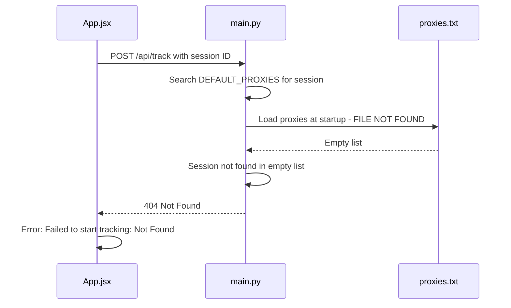

# Tracking Error Fix Plan

## Executive Summary

The "Failed to start tracking: Not Found" error occurs because the backend API cannot find the session ID in its proxy list. The root cause is a **missing `proxies.txt` file** that the backend expects to load at startup.

---

## Part 1: IP Classification Logic Analysis

### Mobile IP Detection

**Location**: [`proxy_checker.py:201`](proxy_checker.py:201)

```python
is_mobile = res.get('mobile', False)
```

The `mobile` flag comes from the IP validation API response (ip-api.com by default). This indicates whether the IP belongs to a mobile network.

### Risky IP Detection

**Location**: [`proxy_checker.py:195-197`](proxy_checker.py:195)

```python
is_hosting = res.get('hosting', False)
is_proxy = res.get('proxy', False)
risk = "CLEAN" if not (is_hosting or is_proxy) else "RISK"
```

An IP is classified as **RISK** if either:
- `hosting = True` - IP belongs to a data center/hosting provider
- `proxy = True` - IP is identified as a proxy server

### Clean IP Detection

An IP is **CLEAN** only when:
- `hosting = False` AND `proxy = False`

### Additional Validation Logic

**Location**: [`proxy_checker.py:202-213`](proxy_checker.py:202)

```python
carrier_list = ['AIRTEL', 'MTN', 'SPECTRANET', 'GLOBACOM', '9MOBILE']
isp_upper = res.get('isp', '').upper()
is_target_carrier = any(c in isp_upper for c in carrier_list)

# Exclude Airtel Rwanda
if "AIRTEL RWANDA" in isp_upper:
    is_target_carrier = False

# Special case for SP 217 in FCT areas
verified_sp217_fct = ['Bwari', 'Abaji', 'Gwagwalada', 'Kuje', 'Kwali']
is_sp217_verified = 'SP 217' in isp_upper and city in verified_sp217_fct
is_valid_carrier = is_target_carrier or is_sp217_verified
```

### Target Profile Match Criteria

**Location**: [`proxy_checker.py:217-221`](proxy_checker.py:217)

```python
fct_cities = ['Bwari', 'Abaji', 'Gwagwalada', 'Kuje', 'Kwali']
city_in_fct = city and (city.startswith('Abuja') or city in fct_cities)
if city_in_fct and is_mobile and is_valid_carrier and risk == "CLEAN":
    indicator = "* "
    matches.append(res)
```

A proxy is marked as a **TARGET PROFILE** when ALL conditions are met:
1. City is in FCT (Abuja or surrounding LGAs)
2. `mobile = True`
3. Valid Nigerian carrier ISP
4. `risk = "CLEAN"` (not hosting, not proxy)

---

## Part 2: Root Cause Analysis

### Error Flow Diagram



### Code Analysis

**1. Proxy File Configuration**

[`backend/main.py:47`](backend/main.py:47):
```python
PROXY_FILE = os.getenv("PROXY_FILE", "../proxies.txt")
```

**2. Proxy Loading at Startup**

[`backend/main.py:236`](backend/main.py:236):
```python
DEFAULT_PROXIES = load_proxies_from_file(PROXY_FILE)
```

**3. Session Lookup in Track Endpoint**

[`backend/main.py:380-389`](backend/main.py:380):
```python
target_proxy = next(
    (p for p in DEFAULT_PROXIES if request.session in p),
    None
)

if not target_proxy:
    raise HTTPException(
        status_code=404,
        detail=f"Session '{request.session}' not found"
    )
```

**4. Frontend Error Handling**

[`frontend/src/App.jsx:690-692`](frontend/src/App.jsx:690):
```javascript
if (!response.ok) {
    throw new Error(`Failed to start tracking: ${response.statusText}`);
}
```

### Root Cause

The `proxies.txt` file does not exist in the project root. The backend loads an empty list at startup, causing all session lookups to fail with 404.

---

## Part 3: Solution

### Option A: Create proxies.txt File (Recommended)

Create a `proxies.txt` file in the project root with the proxy strings from `proxy_checker.py`.

**File content**: Extract the 100 proxy strings from [`proxy_checker.py:19-120`](proxy_checker.py:19)

### Option B: Update Backend to Use Embedded Proxies

Modify the backend to include fallback proxies when the file is missing.

### Option C: Dynamic Proxy Registration

Add an API endpoint to register proxies dynamically without requiring a file.

---

## Implementation Steps

### Step 1: Create proxies.txt

Create `proxies.txt` in the project root with all proxy strings from `proxy_checker.py`.

### Step 2: Verify Backend Loads Proxies

Restart the backend and verify it logs: `Loaded N proxies from ../proxies.txt`

### Step 3: Test Tracking

Use the frontend to start tracking a session and verify it works.

---

## Files to Modify

| File | Action |
|------|--------|
| `proxies.txt` | Create new file with proxy data |
| `backend/main.py` | Optional: Add better error handling for missing file |

---

## Verification Checklist

- [ ] `proxies.txt` exists in project root
- [ ] Backend logs show proxies loaded at startup
- [ ] `/api/status` endpoint shows `default_proxies > 0`
- [ ] Tracking a session returns success instead of 404
